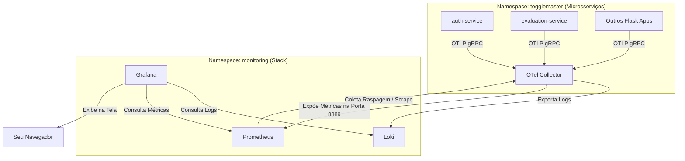

# Guia de Visualização de Dados: Prometheus, Loki e Grafana

Este guia prático explica como os dados de telemetria trafegam no ToggleMaster e como acessá-los e consultá-los no Prometheus, Loki e Grafana para validação da Fase 4.

---

## 1. Fluxo de Dados de Telemetria



1. **A Aplicação** gera logs e métricas. Graças ao código instrumentado com o SDK do OpenTelemetry, ela envia esses dados via protocolo padrão **OTLP** para a porta `4317` do **OTel Collector**.
2. **O OTel Collector** recebe a telemetria, organiza e:
   * Envia os **logs** ativamente para o **Loki**.
   * Expõe as **métricas** formatadas na porta `8889` (no endpoint `/metrics`).
3. **O Prometheus** vasculha o cluster procurando serviços com a anotação `prometheus.io/scrape: "true"`, acha o OTel Collector e puxa ("scrape") as métricas dele a cada 15 segundos.
4. **O Grafana** conecta no Loki e no Prometheus como fontes de dados ("Data Sources") e monta os gráficos na sua tela.

---

## 2. Passo a Passo para Acessar o Grafana

Assim que o Terraform e o ArgoCD terminarem de subir tudo:

### Passo A: Obter a senha do usuário `admin` do Grafana
*(Nota: Certifique-se de que a stack de monitoramento foi instalada via Helm antes de executar este comando, caso contrário o namespace `monitoring` e a secret não existirão).*

O Helm gera uma senha aleatória segura que fica salva numa secret do Kubernetes. Escolha o comando correspondente ao seu terminal para descriptografá-la:

**No Windows (PowerShell):**
```powershell
[System.Text.Encoding]::UTF8.GetString([System.Convert]::FromBase64String((kubectl get secret --namespace monitoring grafana -o jsonpath="{.data.admin-password}")))
```

**No Linux / macOS (Bash):**
```bash
kubectl get secret --namespace monitoring grafana -o jsonpath="{.data.admin-password}" | base64 --decode
```

*Copie o texto que aparecer. O usuário padrão é `admin`.*

### Passo B: Criar um túnel de acesso (Port-Forward)
Para abrir o Grafana no navegador do seu computador local:
```bash
kubectl port-forward svc/grafana 3000:80 -n monitoring
```
Agora, abra o seu navegador no endereço: **`http://localhost:3000`** e faça o login com `admin` e a senha obtida no Passo A.

---

## 3. Como Visualizar os Logs Centralizados (Loki)

Para testar se os logs das suas aplicações estão chegando no Loki:

1. No painel esquerdo do Grafana, clique no ícone de bússola (**Explore**).
2. No menu suspenso de **Data Source** (canto superior esquerdo), selecione **Loki**.
3. Na caixa de busca (Query), digite a query LogQL abaixo para ver os logs do namespace da sua aplicação:
   ```logql
   {namespace="togglemaster"}
   ```
4. Se quiser ver logs específicos de apenas um microsserviço, digite:
   ```logql
   {service_name="auth-service"}
   ```
5. Clique em **Run query** (canto superior direito). Você verá todos os logs do container aparecendo em tempo real na tela!

---

## 4. Como Visualizar as Métricas (Prometheus)

Para testar se o Prometheus está coletando as métricas das aplicações através do OTel Collector:

1. Vá novamente na aba **Explore** do Grafana.
2. Mude o **Data Source** para **Prometheus**.
3. No campo de query, digite o nome de uma métrica gerada pelo OpenTelemetry HTTP handler. Por exemplo, digite:
   ```promql
   http_server_duration_count
   ```
   *(Esta métrica conta quantas requisições HTTP cada microsserviço processou).*
4. Se quiser filtrar a contagem para mostrar apenas as requisições do `auth-service`, faça:
   ```promql
   http_server_duration_count{service_name="auth-service"}
   ```
5. Clique em **Run query**. Mude a visualização de "Table" para **Graph** para ver a linha do tempo das requisições subindo à medida que você envia chamadas de teste!
