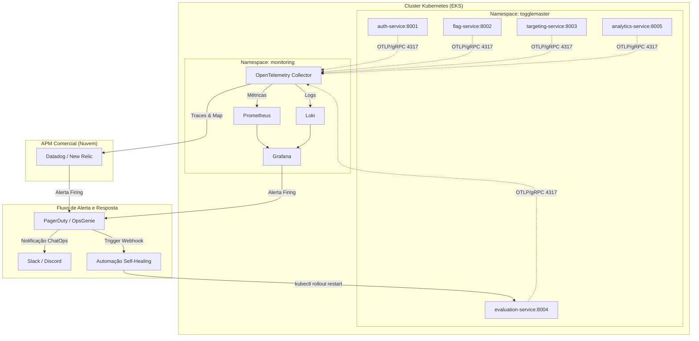

# Guia de Implementação e Passo a Passo - Fase 4: Observabilidade e Resposta Ativa

Este documento detalha o guia passo a passo completo para implementar a arquitetura de **Observabilidade Total e Resposta Ativa** exigida para a Fase 4 do Tech Challenge (ToggleMaster), adaptado especificamente para as linguagens, portas e a estrutura de microsserviços do repositório.

---

## 🏗️ Arquitetura de Observabilidade do ToggleMaster

Abaixo está o diagrama do fluxo de dados de monitoramento e autocura planejado para o ecossistema ToggleMaster:



---

## 🛠️ Sumário das Etapas
0. [Etapa 0: Preparação do Ambiente AWS & Terraform (A cada reinício de Lab)](#etapa-0-preparação-do-ambiente-aws--terraform-a-cada-reinício-de-lab)
1. [Etapa 1: Instalar a Stack de Monitoramento no Cluster (Prometheus, Loki, Grafana)](#etapa-1-instalar-a-stack-de-monitoramento-no-cluster-prometheus-loki-grafana)
2. [Etapa 2: Deploy do OpenTelemetry Collector no Cluster](#etapa-2-deploy-do-opentelemetry-collector-no-cluster)
3. [Etapa 3: Instrumentação Específica do Código das Aplicações](#etapa-3-instrumentação-específica-do-código-das-aplicações)
   * [3.1. Microsserviços Go (auth-service e evaluation-service)](#31-microsserviços-go-auth-service-e-evaluation-service)
   * [3.2. Microsserviços Python/Flask (flag-service, targeting-service e analytics-service)](#32-microsserviços-pythonflask-flag-service-targeting-service-e-analytics-service)
4. [Etapa 4: Integração de APM (Datadog ou New Relic) via OTel](#etapa-4-integração-de-apm-datadog-ou-new-relic-via-otel)
5. [Etapa 5: Dashboard no Grafana com Métricas e Logs Consolidados](#etapa-5-dashboard-no-grafana-com-métricas-e-logs-consolidados)
6. [Etapa 6: Configuração de Alertas Inteligentes e Ferramenta de Incidentes](#etapa-6-configuração-de-alertas-inteligentes-e-ferramenta-de-incidentes)
7. [Etapa 7: Implementação do Script e Fluxo de Self-Healing](#etapa-7-implementação-do-script-e-fluxo-de-self-healing)
8. [Etapa 8: Roteiro Super Detalhado do Vídeo de Validação (25 min)](#etapa-8-roteiro-super-detalhado-do-vídeo-de-validação-25-min)
9. [Etapa 9: Estrutura do Relatório de Entrega (.PDF)](#etapa-9-estrutura-do-relatório-de-entrega-pdf)

---

## ETAPA 0: Preparação do Ambiente AWS & Terraform (A cada reinício de Lab)

Sempre que reiniciar o laboratório na AWS Academy, o ID da conta AWS e as credenciais temporárias mudam. Cada integrante do grupo deve executar os passos abaixo no seu próprio ambiente para conseguir subir o Terraform com sucesso.

### 0.1. Atualizar as Credenciais da AWS Localmente
Copie o bloco de credenciais temporárias disponibilizado no painel do AWS Academy (botão "AWS CLI") e cole-o no seu arquivo local de credenciais em `~/.aws/credentials` (no Windows, fica em `C:\Users\<Usuario>\.aws\credentials`):
```ini
[default]
aws_access_key_id=ASIA...
aws_secret_access_key=...
aws_session_token=...
```

### 0.2. Atualizar as Secrets do Repositório GitHub
No painel do seu repositório no GitHub, vá em **Settings > Secrets and variables > Actions** e atualize os valores das seguintes Secrets com as informações da sua nova sessão:
* `AWS_ACCESS_KEY_ID`
* `AWS_SECRET_ACCESS_KEY`
* `AWS_SESSION_TOKEN`
* `AWS_ACCOUNT_ID` (insira o ID numérico da sua conta atual, ex: `781659100115`)
* `AWS_REGION` (geralmente `us-east-1`)

> [!NOTE]
> As Secrets `TF_VAR_EKS_CLUSTER_ROLE_ARN` e `TF_VAR_EKS_NODE_ROLE_ARN` **não precisam mais ser atualizadas manualmente**! A infraestrutura do Terraform foi atualizada para buscar dinamicamente as roles `LabEksClusterRole` e `LabEksNodeRole` geradas automaticamente pelo AWS Academy para a sua conta atual.

### 0.3. Criar o S3 Bucket de State na Conta AWS
Como a conta AWS do laboratório é nova a cada reinício, o bucket de state do Terraform não existe e deve ser criado manualmente uma única vez no início da sessão. Rode o comando abaixo no seu terminal local:
```bash
aws s3 mb s3://<SEU_AWS_ACCOUNT_ID>-togglemaster-tfstate --region us-east-1
```
*(Substitua `<SEU_AWS_ACCOUNT_ID>` pelo ID numérico da sua conta atual)*

### 0.4. Alinhamento dos Arquivos com o Novo ID de Conta
Substitua todas as ocorrências do ID da conta AWS antigo nos arquivos do projeto pelo seu novo ID numérico:
1. **Terraform Backend**: No arquivo `infra/terraform/providers.tf`, configure o nome correto do bucket no campo `bucket`:
   `bucket = "<SEU_AWS_ACCOUNT_ID>-togglemaster-tfstate"`
2. **Deployments do GitOps**: Nos arquivos de deployment em `gitops/apps/*/deployment.yaml`, atualize o ID no caminho da imagem ECR.
3. **ConfigMaps**: Em `k8s/configmap.yaml`, `k8s/3-configmap.yaml` e `gitops/cluster/configmap.yaml`, atualize o ID da conta na URL da fila SQS (`AWS_SQS_URL`).

### 0.5. Ajustar Versão do Kubernetes (EKS)
O AWS EKS descontinuou a versão `1.28`. Certifique-se de que a variável `eks_cluster_version` esteja configurada como **`1.30`** (ou outra versão estável ativa) nos arquivos:
* `infra/terraform/variables.tf` (valor `default`)
* `infra/terraform/terraform.tfvars`

### 0.6. Evitar Conflitos de Recursos Órfãos (`AlreadyExists`)
Se por algum motivo a execução do Terraform local ou uma sessão anterior foi interrompida de forma incompleta, os bancos de dados RDS ou Redis podem ter sido criados na AWS, mas não estarem registrados no arquivo de estado. Se você receber erros do tipo `DBInstanceAlreadyExists` ou `CacheClusterAlreadyExists` no pipeline:
1. Delete manualmente os recursos órfãos pelo console da AWS ou via CLI:
   ```bash
   aws rds delete-db-instance --db-instance-identifier togglemaster-homolog-auth-db --skip-final-snapshot
   aws rds delete-db-instance --db-instance-identifier togglemaster-homolog-flag-db --skip-final-snapshot
   aws rds delete-db-instance --db-instance-identifier togglemaster-homolog-targeting-db --skip-final-snapshot
   aws elasticache delete-cache-cluster --cache-cluster-id togglemaster-homolog-redis
   ```
2. Aguarde que eles terminem de deletar por completo antes de rodar o pipeline do Terraform novamente.

### 0.7. Roteiro Diário de Inicialização (Subir a Fase 3 e Conectar)
Sempre que o tempo de 3 horas do laboratório expirar e tudo for apagado, siga este roteiro de 5 passos rápidos para reativar todo o ambiente:

#### Passo 1: Subir a Infraestrutura (Fase 3)
1. Atualize suas credenciais locais e do GitHub (conforme seções **0.1** e **0.2**).
2. Se for a primeira vez no dia, crie o S3 Bucket de State (seção **0.3**).
3. Vá no painel do GitHub > **Actions** > selecione **Terraform Apply Manual** > clique em **Run workflow** (escrevendo `APPLY`). Aguarde a conclusão da criação do cluster (10 a 15 minutos).

#### Passo 2: Conectar o Terminal Local ao Novo Cluster
Assim que a esteira terminar, o cluster EKS estará rodando, mas seu terminal local ainda não sabe disso. Atualize sua configuração de conexão do `kubectl`:
```bash
aws eks update-kubeconfig --name togglemaster-eks-homolog --region us-east-1
```
*Teste a conexão rodando: `kubectl get nodes`*

#### Passo 3: Instalar o ArgoCD no Novo Cluster
Como o cluster é novo, o ArgoCD precisa ser reinstalado. Adicione o repositório Helm correto e execute a instalação:
```bash
helm repo add argo https://argoproj.github.io/argo-helm
helm repo update
helm install argocd argo/argo-cd --namespace argocd --create-namespace
```

#### Passo 4: Fazer o Bootstrap das Aplicações via GitOps
Aplique o manifesto de bootstrap para que o ArgoCD recrie automaticamente as nossas aplicações e configurações no namespace `togglemaster`:
```bash
kubectl apply -f gitops/argocd-bootstrap.yaml
```
*(O ArgoCD detectará o repositório e começará a baixar os microsserviços automaticamente).*

#### Passo 5: Inicializar as Ferramentas de Observabilidade
1. Crie o namespace de monitoramento e instale a stack do Prometheus, Grafana e Loki via Helm:
```bash
helm repo add prometheus-community https://prometheus-community.github.io/helm-charts
helm repo add grafana https://grafana.github.io/helm-charts
helm repo update

kubectl create namespace monitoring

helm install prometheus prometheus-community/prometheus --namespace monitoring --set alertmanager.enabled=false --set server.persistentVolume.enabled=false
helm install grafana grafana/grafana --namespace monitoring --set persistence.enabled=false --set service.type=LoadBalancer
helm install loki grafana/loki-stack --namespace monitoring --set loki.persistence.enabled=false,promtail.enabled=true
```
2. O ArgoCD sincronizará automaticamente o OTel Collector e o receptor de autocura (webhook-receiver) definidos na pasta `gitops/monitoring` (devido à aplicação do bootstrap no Passo 4).

### 0.8. Notas Importantes de Capacidade & Troubleshooting (EKS e ECR)
*   **Capacidade de Pods (Too many pods):** Os nós do EKS no AWS Academy possuem limitação de rede que restringe a capacidade a **11 pods por nó**. Para evitar que os microsserviços fiquem travados em status `Pending`, o grupo de nós foi configurado para escalar até 4 nós. Se necessário escalar manualmente via CLI, rode:
    ```bash
    aws eks update-nodegroup-config --cluster-name togglemaster-eks-homolog --nodegroup-name togglemaster-eks-homolog-ng --scaling-config desiredSize=4,minSize=2,maxSize=4
    ```
*   **Imagens não encontradas (ImagePullBackOff no ECR):** Sempre que o laboratório é reiniciado, os repositórios do ECR sobem vazios. Certifique-se de realizar o commit e push dos códigos instrumentados para o GitHub, o que disparará os pipelines do GitHub Actions para compilar e publicar as imagens no ECR.
*   **Sincronização do ArgoCD:** O ArgoCD lê as configurações diretamente do repositório remoto do GitHub. Alterações locais nos diretórios de GitOps (`gitops/monitoring` e `gitops/cluster`) só serão aplicadas no cluster após o envio (`git push`) para a branch remota correspondente (`Fase4`).

---

## ETAPA 1: Instalar a Stack de Monitoramento no Cluster (Prometheus, Loki, Grafana)

A stack de monitoramento será instalada no namespace isolado `monitoring` no cluster Kubernetes.

### 1.1. Configuração dos Repositórios Helm
**Cole no terminal:**
```bash
helm repo add prometheus-community https://prometheus-community.github.io/helm-charts
helm repo add grafana https://grafana.github.io/helm-charts
helm repo update
```

### 1.2. Criar Namespace e Instalar Prometheus e Grafana
```bash
kubectl create namespace monitoring

# Instalar Prometheus (sem Alertmanager local, pois usaremos Grafana/APM para alertas)
helm install prometheus prometheus-community/prometheus \
  --namespace monitoring \
  --set alertmanager.enabled=false \
  --set server.persistentVolume.enabled=false

# Instalar Grafana com Service do tipo LoadBalancer para fácil acesso externo
helm install grafana grafana/grafana \
  --namespace monitoring \
  --set persistence.enabled=false \
  --set service.type=LoadBalancer
```

> [!TIP]
> Obtenha a senha do usuário `admin` do Grafana rodando:
>
> **No Windows (PowerShell):**
> ```powershell
> [System.Text.Encoding]::UTF8.GetString([System.Convert]::FromBase64String((kubectl get secret --namespace monitoring grafana -o jsonpath="{.data.admin-password}")))
> ```
>
> **No Linux / macOS (Bash):**
> ```bash
> kubectl get secret --namespace monitoring grafana -o jsonpath="{.data.admin-password}" | base64 --decode
> ```

### 1.3. Instalar o Grafana Loki para Coleta de Logs
```bash
# Instalar Loki em conjunto com o Promtail para raspagem automática de logs
helm install loki grafana/loki-stack \
  --namespace monitoring \
  --set loki.persistence.enabled=false,promtail.enabled=true
```

---

## ETAPA 2: Deploy do OpenTelemetry Collector no Cluster

O **OTel Collector** recebe logs, métricas e traces das nossas aplicações e os exporta para os destinos correspondentes.

### 2.1. Criar Secrets para as APIs de APM
Crie a secret para armazenar as credenciais da conta do APM (Datadog ou New Relic):
```bash
# Substitua pelo valor real ou use string vazia na chave que não for usar
kubectl create secret generic apm-secrets \
  --namespace monitoring \
  --from-literal=datadog-api-key="SUA_API_KEY_DATADOG" \
  --from-literal=newrelic-api-key="SUA_API_KEY_NEW_RELIC"
```

### 2.2. Criar `otel-collector-config.yaml`
```yaml
apiVersion: v1
kind: ConfigMap
metadata:
  name: otel-collector-config
  namespace: monitoring
data:
  otel-collector-config.yaml: |
    receivers:
      otlp:
        protocols:
          grpc:
            endpoint: 0.0.0.0:4317
          http:
            endpoint: 0.0.0.0:4318

    processors:
      batch:
        send_batch_size: 1000
        timeout: 10s
      memory_limiter:
        check_interval: 1s
        limit_percentage: 75
        spike_limit_percentage: 15

    exporters:
      prometheus:
        endpoint: "0.0.0.0:8889"
        namespace: "togglemaster"
      
      loki:
        endpoint: "http://loki.monitoring.svc.cluster.local:3100/loki/api/v1/push"
      
      # Exporter para Datadog
      datadog:
        api:
          key: "${env:DATADOG_API_KEY}"
          site: "datadoghq.com"

      # Exporter para New Relic via OTLP gRPC
      otlp/newrelic:
        endpoint: "otlp.nr-data.net:4317"
        headers:
          api-key: "${env:NEW_RELIC_API_KEY}"

    service:
      pipelines:
        metrics:
          receivers: [otlp]
          processors: [memory_limiter, batch]
          exporters: [prometheus, datadog] # remova 'datadog' ou 'otlp/newrelic' dependendo da escolha
        traces:
          receivers: [otlp]
          processors: [memory_limiter, batch]
          exporters: [datadog] # ou [otlp/newrelic]
        logs:
          receivers: [otlp]
          processors: [memory_limiter, batch]
          exporters: [loki]
```

### 2.3. Criar `otel-collector-deployment.yaml`
```yaml
apiVersion: apps/v1
kind: Deployment
metadata:
  name: otel-collector
  namespace: monitoring
spec:
  replicas: 1
  selector:
    matchLabels:
      app: otel-collector
  template:
    metadata:
      labels:
        app: otel-collector
    spec:
      containers:
      - name: otel-collector
        image: otel/opentelemetry-collector-contrib:latest
        resources:
          limits:
            cpu: 500m
            memory: 512Mi
          requests:
            cpu: 100m
            memory: 128Mi
        ports:
        - containerPort: 4317
        - containerPort: 4318
        - containerPort: 8889
        volumeMounts:
        - name: collector-config
          mountPath: /etc/otelcol-contrib
        env:
        - name: DATADOG_API_KEY
          valueFrom:
            secretKeyRef:
              name: apm-secrets
              key: datadog-api-key
              optional: true
        - name: NEW_RELIC_API_KEY
          valueFrom:
            secretKeyRef:
              name: apm-secrets
              key: newrelic-api-key
              optional: true
      volumes:
      - name: collector-config
        configMap:
          name: otel-collector-config
          items:
          - key: otel-collector-config.yaml
            path: config.yaml
---
apiVersion: v1
kind: Service
metadata:
  name: otel-collector
  namespace: monitoring
spec:
  ports:
  - name: otlp-grpc
    port: 4317
    targetPort: 4317
    protocol: TCP
  - name: otlp-http
    port: 4318
    targetPort: 4318
    protocol: TCP
  - name: prometheus
    port: 8889
    targetPort: 8889
    protocol: TCP
  selector:
    app: otel-collector
```

Aplique ambos os arquivos no cluster:
```bash
kubectl apply -f otel-collector-config.yaml
kubectl apply -f otel-collector-deployment.yaml
```

---

## ETAPA 3: Instrumentação Específica do Código das Aplicações

A instrumentação das aplicações garante a visibilidade profunda das transações entre microsserviços. Como possuímos linguagens distintas (Go e Python), cada ecossistema será instrumentado de forma adequada.

---

### 3.1. Microsserviços Go (`auth-service` e `evaluation-service`)

#### A. Adicionar dependências no `go.mod`
Na pasta de cada serviço Go, execute:
```bash
go get go.opentelemetry.io/otel \
       go.opentelemetry.io/otel/sdk \
       go.opentelemetry.io/otel/exporters/otlp/otlptrace/otlptracegrpc \
       go.opentelemetry.io/otel/exporters/otlp/otlpmetric/otlpmetricgrpc \
       go.opentelemetry.io/contrib/instrumentation/net/http/otelhttp
```

#### B. Criar o arquivo `telemetry.go` no mesmo nível do `main.go`
Este módulo inicializa o SDK do OTel e conecta com o OTel Collector no Kubernetes.

```go
package main

import (
	"context"
	"fmt"
	"os"
	"time"

	"go.opentelemetry.io/otel"
	"go.opentelemetry.io/otel/exporters/otlp/otlpmetric/otlpmetricgrpc"
	"go.opentelemetry.io/otel/exporters/otlp/otlptrace/otlptracegrpc"
	"go.opentelemetry.io/otel/propagation"
	"go.opentelemetry.io/otel/sdk/metric"
	"go.opentelemetry.io/otel/sdk/resource"
	sdktrace "go.opentelemetry.io/otel/sdk/trace"
	semconv "go.opentelemetry.io/otel/semconv/v1.4.0"
)

func InitTelemetry(ctx context.Context, serviceName string) (func(), error) {
	otelAgentAddr := os.Getenv("OTEL_EXPORTER_OTLP_ENDPOINT")
	if otelAgentAddr == "" {
		otelAgentAddr = "otel-collector.monitoring.svc.cluster.local:4317"
	}

	res, err := resource.New(ctx,
		resource.WithAttributes(
			semconv.ServiceNameKey.String(serviceName),
		),
	)
	if err != nil {
		return nil, fmt.Errorf("failed to create resource: %w", err)
	}

	// Trace Exporter
	traceExporter, err := otlptracegrpc.New(ctx,
		otlptracegrpc.WithInsecure(),
		otlptracegrpc.WithEndpoint(otelAgentAddr),
	)
	if err != nil {
		return nil, fmt.Errorf("failed to create trace exporter: %w", err)
	}

	tp := sdktrace.NewTracerProvider(
		sdktrace.WithSampler(sdktrace.AlwaysSample()),
		sdktrace.WithBatcher(traceExporter),
		sdktrace.WithResource(res),
	)
	otel.SetTracerProvider(tp)
	otel.SetTextMapPropagator(propagation.NewCompositeTextMapPropagator(propagation.TraceContext{}, propagation.Baggage{}))

	// Metric Exporter
	metricExporter, err := otlpmetricgrpc.New(ctx,
		otlpmetricgrpc.WithInsecure(),
		otlpmetricgrpc.WithEndpoint(otelAgentAddr),
	)
	if err != nil {
		return nil, fmt.Errorf("failed to create metric exporter: %w", err)
	}

	mp := metric.NewMeterProvider(
		metric.WithReader(metric.NewPeriodicReader(metricExporter, metric.WithInterval(10*time.Second))),
		metric.WithResource(res),
	)
	otel.SetMeterProvider(mp)

	shutdown := func() {
		tp.Shutdown(context.Background())
		mp.Shutdown(context.Background())
	}

	return shutdown, nil
}
```

#### C. Integrar no `main.go` do `auth-service`
Integre a telemetria ao ciclo de vida e utilize o middleware `otelhttp` para interceptar as requisições recebidas no `http.NewServeMux()`:

```diff
 func main() {
 	// Carrega o .env para desenvolvimento local. Em produção, isso não fará nada.
 	_ = godotenv.Load()
 
+	// Inicializa OpenTelemetry
+	ctxCtx := context.Background()
+	shutdown, errOtel := InitTelemetry(ctxCtx, "auth-service")
+	if errOtel != nil {
+		log.Fatalf("Falha ao iniciar telemetria: %v", errOtel)
+	}
+	defer shutdown()
+
 	// --- Configuração ---
 	port := os.Getenv("PORT")
 	if port == "" {
...
 	log.Printf("Serviço de Autenticação (Go) rodando na porta %s", port)
 	handler := corsMiddleware(mux)
-	if err := http.ListenAndServe(":"+port, handler); err != nil {
-		log.Fatal(err)
-	}
+	
+	// Wrap Handler com OpenTelemetry
+	otelHandler := otelhttp.NewHandler(handler, "auth-service")
+	if err := http.ListenAndServe(":"+port, otelHandler); err != nil {
+		log.Fatal(err)
+	}
 }
```

#### D. Integrar no `main.go` e no `HttpClient` do `evaluation-service`
Como o `evaluation-service` realiza chamadas externas HTTP para o `flag-service` e `targeting-service`, precisamos instrumentar tanto o servidor HTTP que recebe requisições quanto o cliente HTTP (`HttpClient`) que faz as requisições de saída.

Em `main.go`:
```diff
 func main() {
 	_ = godotenv.Load() // Carrega .env para dev local
 
+	// Inicializa OpenTelemetry
+	ctxCtx := context.Background()
+	shutdown, errOtel := InitTelemetry(ctxCtx, "evaluation-service")
+	if errOtel != nil {
+		log.Fatalf("Falha ao iniciar telemetria: %v", errOtel)
+	}
+	defer shutdown()
+
 	// --- Configuração ---
 	port := os.Getenv("PORT")
...
-	// Cliente HTTP (com timeout)
-	httpClient := &http.Client{
-		Timeout: 5 * time.Second,
-	}
+	// Cliente HTTP Instrumentado com OTel para propagação de contexto de Tracing
+	httpClient := &http.Client{
+		Timeout:   5 * time.Second,
+		Transport: otelhttp.NewTransport(http.DefaultTransport),
+	}
...
 	log.Printf("Serviço de Avaliação (Go) rodando na porta %s", port)
 	handler := corsMiddleware(mux)
-	if err := http.ListenAndServe(":"+port, handler); err != nil {
-		log.Fatal(err)
-	}
+	
+	// Wrap Handler com OpenTelemetry
+	otelHandler := otelhttp.NewHandler(handler, "evaluation-service")
+	if err := http.ListenAndServe(":"+port, otelHandler); err != nil {
+		log.Fatal(err)
+	}
 }
```

---

### 3.2. Microsserviços Python/Flask (`flag-service`, `targeting-service` e `analytics-service`)

Para as três aplicações Flask, usaremos a instrumentação baseada no SDK oficial.

#### A. Atualizar `requirements.txt`
Adicione as dependências ao final do `requirements.txt` de cada um dos três serviços Python:
```text
opentelemetry-api==1.24.0
opentelemetry-sdk==1.24.0
opentelemetry-instrumentation-flask==0.45b0
opentelemetry-instrumentation-requests==0.45b0
opentelemetry-exporter-otlp-proto-grpc==1.24.0
```

#### B. Atualizar o código inicial do `app.py`
Adicione a inicialização do Tracer e a instrumentação do Flask e do cliente `requests` no topo do arquivo (exemplo para o `flag-service`):

```python
import os
import sys
from flask import Flask, request, jsonify
from flask_cors import CORS

# --- Configuração OpenTelemetry ---
from opentelemetry import trace
from opentelemetry.sdk.trace import TracerProvider
from opentelemetry.sdk.trace.export import BatchSpanProcessor
from opentelemetry.sdk.resources import Resource
from opentelemetry.exporter.otlp.proto.grpc.trace_exporter import OTLPSpanExporter
from opentelemetry.instrumentation.flask import FlaskInstrumentor
from opentelemetry.instrumentation.requests import RequestsInstrumentor

# Lê o endpoint do OTel Collector das variáveis de ambiente
otel_endpoint = os.getenv("OTEL_EXPORTER_OTLP_ENDPOINT", "otel-collector.monitoring.svc.cluster.local:4317")
if not otel_endpoint.startswith("http"):
    otel_endpoint = f"http://{otel_endpoint}"

resource = Resource.create(attributes={"service.name": "flag-service"}) # Altere para o respectivo nome do serviço
provider = TracerProvider(resource=resource)
processor = BatchSpanProcessor(OTLPSpanExporter(endpoint=otel_endpoint, insecure=True))
provider.add_span_processor(processor)
trace.set_tracer_provider(provider)

# Instrumenta chamadas HTTP de saída do pacote requests (para validar a API key no auth-service)
RequestsInstrumentor().instrument()

app = Flask(__name__)
# Instrumenta rotas Flask recebidas
FlaskInstrumentor().instrument_app(app)
CORS(app)
```

> [!IMPORTANT]
> Garanta que os Dockerfiles dos serviços Python e Go copiem e executem a instalação com as novas dependências. Como os Dockerfiles copiam o `requirements.txt` e executam `pip install --no-cache-dir -r requirements.txt`, a atualização do arquivo basta para o build das novas imagens.

---

### 3.3. Configuração de Variáveis Globais via GitOps (`gitops/cluster/configmap.yaml`)

Edite o seu ConfigMap global para adicionar o endpoint do OTel Collector de forma que todas as réplicas saibam para onde enviar as telemetrias por padrão:

```yaml
apiVersion: v1
kind: ConfigMap
metadata:
  name: app-config
  namespace: togglemaster
data:
  # ... configurações existentes ...
  OTEL_EXPORTER_OTLP_ENDPOINT: "otel-collector.monitoring.svc.cluster.local:4317"
```

---

## ETAPA 4: Integração de APM (Datadog ou New Relic) via OTel

Para visualizar o Service Map e realizar o Distributed Tracing das chamadas complexas (por exemplo: Client -> `evaluation-service` -> `flag-service` & `targeting-service` -> `auth-service`), configure seu APM comercial.

### 4.1. Configuração do Exportador do OTel Collector
De acordo com a ferramenta comercial selecionada por você na **Etapa 2**:

*   **Se usar Datadog**: Certifique-se de preencher a Secret `datadog-api-key` e habilitar o exporter `datadog` nas seções de `metrics` e `traces` no pipeline do Collector.
*   **Se usar New Relic**: Certifique-se de preencher a Secret `newrelic-api-key` e direcionar os pipelines de métricas e traces para o exporter `otlp/newrelic` com destino para `otlp.nr-data.net:4317` utilizando gRPC.

---

## ETAPA 5: Dashboard no Grafana com Métricas e Logs Consolidados

No Grafana integrado ao cluster K8s, configure os dashboards de monitoramento rápido.

### 5.1. Conectar Data Sources
Acesse a URL do Grafana do cluster e configure:
1.  **Prometheus**:
    *   Vá em Configurações > Data Sources > Add data source > Escolha **Prometheus**.
    *   URL de Conexão: `http://prometheus-server.monitoring.svc.cluster.local`
2.  **Loki**:
    *   Vá em Configurações > Data Sources > Add data source > Escolha **Loki**.
    *   URL de Conexão: `http://loki.monitoring.svc.cluster.local:3100`

### 5.2. Querys do Dashboard Customizado
Crie um dashboard com 3 painéis (Panels) essenciais:

1.  **Métrica de CPU e Memória por Pod**:
    *   Painel: Time Series.
    *   Query Prometheus (CPU): `sum(rate(container_cpu_usage_seconds_total{namespace="togglemaster"}[5m])) by (pod)`
    *   Query Prometheus (RAM): `sum(container_memory_working_set_bytes{namespace="togglemaster"}) by (pod)`
2.  **Volumetria de Requisições por Serviço**:
    *   Painel: Bar Gauge / Time Series.
    *   Query Prometheus (Taxa de requisições por segundo):
        `sum(rate(togglemaster_http_requests_total[2m])) by (service)` (Gerado automaticamente pela instrumentação OTel das aplicações)
3.  **Visualização de Logs consolidada (Loki)**:
    *   Painel: Logs.
    *   Query Loki: `{namespace="togglemaster"}`

---

## ETAPA 6: Configuração de Alertas Inteligentes e Ferramenta de Incidentes

Definiremos a regra para alertar quando o serviço crítico `evaluation-service` começar a falhar silenciosamente (retornando erros de Gateway / HTTP 5xx devido a instabilidades de rede ou banco de dados).

### 6.1. Criar Regra de Alerta (Grafana)
1.  Vá em **Alerting** > **Alert rules** > **Create rule**.
2.  Defina a query baseada nas métricas HTTP OTel:
    ```promql
    sum(rate(http_server_duration_count{http_status=~"5..", service_name="evaluation-service"}[2m])) 
    / 
    sum(rate(http_server_duration_count{service_name="evaluation-service"}[2m])) * 100 > 5
    ```
    *(Esta regra dispara se a taxa de erro HTTP 5xx do serviço for maior que 5% por mais de 2 minutos)*
3.  Configure o status para disparar quando a condição for verdadeira.

### 6.2. Configurar Canal de Incidentes (PagerDuty ou OpsGenie)
1.  **Criação**: Acesse o PagerDuty ou OpsGenie e crie uma conta gratuita corporativa ou trial.
2.  **Integração**: Crie uma rota/integração do tipo **Grafana Integration** para obter o link do Webhook.
3.  **Grafana Contact Point**: No painel do Grafana Alerting, vá em **Contact points** > **New contact point**, selecione **PagerDuty** ou **OpsGenie**, adicione a chave gerada e salve.

### 6.3. ChatOps no Discord ou Slack
Integre a notificação final de incidentes para que a equipe seja informada no canal de chat.
*   **Discord Webhook**: Vá nas configurações do seu servidor Discord > Integrações > Criar Webhook. Copie a URL.
*   **Grafana Contact Point**: Crie mais um Contact Point no Grafana do tipo **Discord**, insira a URL do Webhook do Discord e adicione ao Contact Point principal para rodar junto com o alerta de incidentes.

---

## ETAPA 7: Implementação do Script e Fluxo de Self-Healing

Para resolver a indisponibilidade silenciosa sem a necessidade de intervenção humana durante a madrugada, configuramos o auto-healing.

### 7.1. Fluxo de Execução
```
Grafana Alerta (Firing) ➔ Envia Webhook HTTP ➔ Servidor de Automação / GitHub Actions ➔ kubectl rollout restart deployment/evaluation-service
```

### 7.2. Script de Autocura (`scripts/self-healing.sh`)
Crie o arquivo abaixo para automatizar o restart do deployment problemático `evaluation-service`:

```bash
#!/bin/bash
# -----------------------------------------------------------------------------
# Script de Auto-Cura (Self-Healing) - ToggleMaster
# -----------------------------------------------------------------------------

TARGET_DEPLOYMENT="evaluation-service"
NAMESPACE="togglemaster"

echo "[$(date '+%Y-%m-%d %H:%M:%S')] 🚨 Alerta de falha recebido!"
echo "[$(date '+%Y-%m-%d %H:%M:%S')] 🔧 Executando autocura no deployment: $TARGET_DEPLOYMENT..."

# Aciona a reinicialização segura (rolling restart) no cluster
kubectl rollout restart deployment/$TARGET_DEPLOYMENT -n $NAMESPACE

# Aguarda a conclusão da reinicialização (timeout de 60s)
if kubectl rollout status deployment/$TARGET_DEPLOYMENT -n $NAMESPACE --timeout=60s; then
    echo "[$(date '+%Y-%m-%d %H:%M:%S')] ✅ Self-healing concluído com sucesso. Pods do $TARGET_DEPLOYMENT reciclados."
    
    # Exemplo opcional de notificação direta via Curl no Slack/Discord
    # curl -X POST -H 'Content-type: application/json' --data '{"content":"✅ *Self-Healing executado com sucesso*: O serviço `evaluation-service` foi reiniciado automaticamente e está saudável!"}' $DISCORD_WEBHOOK_URL
else
    echo "[$(date '+%Y-%m-%d %H:%M:%S')] ❌ Erro: Falha ao restabelecer o deployment $TARGET_DEPLOYMENT dentro do limite de tempo."
    exit 1
fi
```

Make it executable in Git:
```bash
chmod +x scripts/self-healing.sh
```

---

## ETAPA 8: Roteiro Super Detalhado do Vídeo de Validação (25 min)

O vídeo de avaliação é a sua principal prova real e não deve conter cortes nas transições de demonstração prática. Abaixo está o roteiro estruturado minuto a minuto para garantir que você demonstre todos os critérios avaliados e garanta a nota máxima.

---

| Minuto | Bloco | O que mostrar na tela | O que falar / Demonstrar |
| :--- | :--- | :--- | :--- |
| **0:00 - 3:00** | **Introdução & Setup GitOps** | • Dashboard do ArgoCD (`argocd-bootstrap`) ativo.<br>• Comando `kubectl get nodes` rodando.<br>• Recursos do namespace `monitoring` e `togglemaster` saudáveis. | • Apresente os membros do grupo.<br>• Mostre que a infraestrutura provisionada via Terraform na Fase 3 está rodando perfeitamente integrada à nova stack.<br>• Destaque que os 5 microsserviços estão implantados automaticamente via ArgoCD. |
| **3:00 - 8:00** | **Métricas e Logs no Grafana** | • Painel do Grafana aberto.<br>• Visualização do Dashboard Customizado.<br>• Navegação na aba Explore usando o Loki com queries `{namespace="togglemaster"}`. | • Mostre a saúde do ecossistema: o painel de consumo de recursos do cluster (CPU e Memória).<br>• Realize algumas requisições manuais para gerar tráfego e mostre a taxa de requisições por segundo (RPS) subindo.<br>• Mostre os logs centralizados vindos dos containers do cluster via Loki e explique brevemente como o OpenTelemetry Collector faz essa indexação e rota. |
| **8:00 - 13:00** | **Distributed Tracing & APM** | • Console da solução comercial (Datadog ou New Relic).<br>• Tela do **Service Map** (Mapa de Dependências).<br>• Visualização da linha do tempo detalhada (Trace View). | • Mostre o mapa de dependências mostrando a arquitetura de comunicação real entre os 5 microsserviços do cluster.<br>• Faça uma requisição de teste para o endpoint `/evaluate` do `evaluation-service`. Show no APM a ramificação do trace cruzando os microsserviços `flag-service`, `targeting-service` e chamando o `auth-service` para validação de tokens. Explique como o trace ID foi propagado. |
| **13:00 - 18:00** | **Injeção de Falhas (A Prova Real)** | • Terminal com comandos ativos.<br>• Painel do Grafana/APM no estado do alerta correspondente. | • Explique o cenário de falha a ser injetado (exemplo: parar o pod do Redis ou interromper a rede do `flag-service` usando um NetworkPolicy de bloqueio).<br>• Faça chamadas na rota `/evaluate` mostrando o serviço gerando erros HTTP 5xx.<br>• Mostre o gráfico do alerta inteligente no Grafana/APM mudando do status verde (`OK`) para vermelho (`Firing`). |
| **18:00 - 22:00** | **ChatOps, Incidentes e Autocura** | • Dashboard do PagerDuty/OpsGenie aberto.<br>• Canal do Discord/Slack.<br>• Terminal K8s rodando `kubectl get pods -w`. | • Mostre o incidente sendo aberto automaticamente no PagerDuty/OpsGenie logo após o alerta disparar.<br>• Abra o chat (Slack/Discord) e aponte para a notificação detalhada recebida via Webhook.<br>• Mostre o acionamento do webhook de Self-Healing em tempo real e aponte para o terminal onde os pods antigos do `evaluation-service` são terminados e novos são provisionados pelo script. |
| **22:00 - 25:00** | **Encerramento e Conclusão** | • Dashboard Grafana normalizando.<br>• Código-fonte dos arquivos de instrumentação no editor. | • Faça uma requisição de teste para provar que a aplicação normalizou e o alerta voltou a ficar verde.<br>• Explique rapidamente as decisões de arquitetura e escolhas de ferramentas.<br>• Finalize o vídeo. |

---

## ETAPA 9: Estrutura do Relatório de Entrega (.PDF)

Organize seu relatório final contendo exatamente as seguintes seções estruturadas para garantir pontuação integral:

1.  **Identificação do Projeto**:
    *   Título: *Relatório Técnico de Entrega - Tech Challenge Fase 4: Observabilidade Total e Auto-Cura*
    *   Tabela com o nome de todos os participantes do grupo, RMs e respectivos usernames do GitHub.
2.  **Entregáveis Digitais**:
    *   URL do Repositório Git público contendo o código instrumentado (Go/Python) e a infraestrutura no GitOps.
    *   URL do vídeo explicativo (hospedado no YouTube, Vimeo ou Google Drive aberto).
3.  **Evidências Visuais Firing (Obrigatório)**:
    *   *Print 1*: Dashboard do Grafana ativo exibindo os dados de tráfego, CPU e memória.
    *   *Print 2*: Distributed Trace completo da requisição `/evaluate` cruzando múltiplos serviços na interface do APM (Datadog/New Relic).
    *   *Print 3*: Notificação do ChatOps (Slack ou Discord) detalhando o alerta do incidente disparado.
    *   *Print 4*: Log de execução bem-sucedida do script de Self-Healing e status dos novos pods no terminal.
4.  **Justificativa e Decisões de Arquitetura**:
    *   *Por que foi usado o OpenTelemetry Collector?* Explique como a padronização via OTel evita lock-in de fornecedores.
    *   *Comparativo APM (Datadog vs New Relic)*: Indique qual ferramenta comercial foi escolhida pelo grupo e os critérios utilizados.
    *   *Comparativo Incidentes (PagerDuty vs OpsGenie)*: Explique a importância do controle de fadiga de alertas (Alert Fatigue) e a escolha da plataforma de incidentes.
